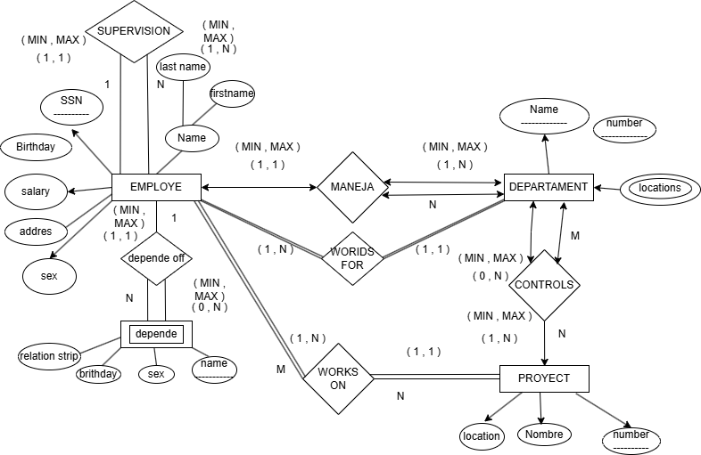

# EJERCICIOS MODELO E-R

---

## Ejercicio 1:

En un hospital se rguistra informacion de sus pacientes de cada pacioente se desea almacenar algo que lo identoifique.

### Atributos por Entidad

| ENTIDAD | ATRIBUTOS |
| :--- | :--- |
| **Paciente** | <ul><li>Algo que lo identifique</li><li>Nombre</li><li>Fecha de nacimento</li></ul> |
| **Expediente médico** | <ul><li>numero de Expediente</li><li>Fecha de Apertura</li><li>Tipo de Sangre</li></ul> |

### Reglas del Negocio
1. Cada paciente debe tener exactamente un expediente medico
2. Cada expediente pertenece a un unico paciente
3. No puede existir ningun expediente medico sin paciente
4. No puede existir un paciente sin expediente

### Diagrama

---

## Ejercicio 2:
Una Universidad administra profesores y cursos.

### Atributos por Entidad

| ENTIDAD | ATRIBUTOS |
| :--- | :--- |
| **Profesor** | <ul><li>Clave Profesor</li><li>Nombre</li><li>Especialidad</li></ul> |
| **Curso** | <ul><li>Identificacion del curso</li><li>Nombre del curso</li><li>Creditos</li></ul> |

### Reglas del Negocio
1. Un profesor puede impartir varios cursos
2. Un curso Solamente Puede Ser impartido por un profesor
3. Puede Ecistir un Porfesor que no imparta Cursos
4. Todo Curso Deve de ser asignado a un profesor

### Elementos a Realizar
* **Entidades**
* **Identificar la relacion:** **IMPARTE**
* **Determinar la cardinalidad**
* **Determinar la participacion**

### Diagrama

---

## Ejercicio 3:
Una Escuela administra alumnos y materias.

### Atributos por Entidad

| ENTIDAD | ATRIBUTOS |
| :--- | :--- |
| **Alumno** | <ul><li>matricula</li><li>nombre</li><li>semetre</li></ul> |
| **Materia** | <ul><li>Clave</li><li>Nombre de la materia</li><li>Creditos</li></ul> |

### Reglas del Negocio
1. Un alumno puede inscribirse en varias materias
2. Una materia puede tener many alumnos inscritos
3. puede existri una materia sin alumnos inscritos
4. Todo alumno deve estar inscrito en almenos 1 materia
5. De cada Inscirpcion se deve almacenar: **Fecha de Inscripcion**, **Calificacion Final**

* **Relacion en las 2 entidades:** **INSCRIBE**

### Diagrama

---

## EJERCICIO 4

Una empresa encargada de realizar venta de productos:

### Atributos por Entidad

| ENTIDAD | ATRIBUTOS |
| :--- | :--- |
| **Cliente** | <ul><li>Numero de cliente que lo identifique</li><li>Y su nombre el cual es una persona moral</li><li>RFC</li></ul> |
| **Pedidos** | <ul><li>Numero de pedido</li><li>Fecha</li></ul> |
| **Productos** | <ul><li>Numero de produto</li><li>Nombre y precio</li></ul> |

> **Nota de Operación:** Al Realizar los pedidos deven reguistra la cantidad de productos y su precio.

### Reglas del Negocio
1. Un cliente puede realizar muchos pedidos
2. Cada pedido pertenece a un solo cliente
3. Un pedidio puede contener varios productos
4. U Producto puede aparceer en muchos pedidos
5. Un pedido deve de contener un producto
6. Un pruducto puede haber no sido vendido
7. el detalle del pedido no existe sin pedido
8. El detalle de pedido no existe sin producto
9. El detalle almacena cantidad y precio de venta

### Diagrama 4

---

## EJERCICIO 5

### 1. Entidades y Atributos Identificados

| ENTIDAD | DETALLE DE ATRIBUTOS |
| :--- | :--- |
| **DEPARTAMENTO** | <ul><li>Nombre (Único / Clave)</li><li>Número (Único / Clave)</li><li>Ubicaciones (Atributo multivalorado: puede tener varias)</li></ul> |
| **PROYECTO** | <ul><li>Nombre (Único / Clave)</li><li>Número (Único / Clave)</li><li>Ubicación (Única)</li></ul> |
| **EMPLEADO** | <ul><li>Número de Seguro Social (SSN) (Clave)</li><li>Nombre</li><li>Dirección</li><li>Salario</li><li>Sexo</li><li>Fecha de nacimiento</li></ul> |
| **DEPENDIENTE** | *Entidad Débil - depende del empleado* <ul><li>Primer Nombre</li><li>Sexo</li><li>Fecha de nacimiento</li><li>Parentesco / Relación</li></ul> |

### 2. Relaciones y Reglas de Negocio Clave

* **Administración de Departamento (1:1):** Un departamento es administrado por un solo empleado. Se debe registrar la **Fecha de inicio** de la gestión.
* **Control de Proyectos (1:N):** Un departamento controla muchos proyectos; un proyecto pertenece a un solo departamento.
* **Asignación de Departamento (1:N):** Un empleado belongs a un único departamento, pero un departamento tiene muchos empleados.
* **Trabajo en Proyectos (N:M):** Un empleado puede trabajar en varios proyectos y un proyecto puede tener muchos empleados. Se debe registrar las **Horas semanales** trabajadas en cada combinación.
* **Supervisión (Recursiva 1:N):** Un empleado tiene un supervisor directo (que también es un empleado).
* **Dependientes (1:N):** Un empleado puede tener muchos dependientes registrados para el seguro.

### Diagrama 5

---
## EJERCICIO 6 
# Ejercicio 6: Control Escolar Integral, Profesores y Proyectos

## 1. Problemática

Se requiere diseñar un sistema de base de datos para una institución educativa con el fin de gestionar el control escolar integral de sus estudiantes, el personal docente y los proyectos de investigación. 

La institución necesita registrar la información personal de sus alumnos, permitiendo almacenar múltiples números de teléfono para un mismo estudiante. Cada alumno debe poseer de manera obligatoria una única credencial física de identificación institucional. Asimismo, se debe llevar un control estricto del historial académico, registrando las materias que cursa cada alumno, la fecha en que se reinscribe en ellas y la calificación final obtenida.

Por otro lado, se debe administrar la plantilla de profesores. Cada profesor pertenece obligatoriamente a un único departamento administrativo asignado a un edificio específico del campus. Los profesores pueden impartir múltiples materias, pero cada materia cuenta con un único profesor titular asignado. Adicionalmente, el sistema debe registrar a los dependientes familiares de cada docente para la gestión de prestaciones. Finalmente, se requiere controlar la participación laboral de los profesores en proyectos de desarrollo institucionales, los cuales manejan un presupuesto asignado, especificando la fecha exacta de inicio del profesor en dicho proyecto y el rol que desempeña.

---

## 2. Atributos por Entidad

| ENTIDAD | ATRIBUTOS |
| :--- | :--- |
| **ALUMNO** | Matricula (Identificador) nombre apellido1 apellido2 Correo Telefono (Multivalorado) |
| **CREDENCIAL** | numcredencial (Identificador) FechaInscrip Vigencia |
| **MATERIA** | Clavemate (Identificador) nombre creditos totalM |
| **PROFESOR** | numprof (Identificador) Nombre (nombre, apellido1, apellido2) |
| **DEPARTAMENTO** | numDep (Identificador) nombre edificio |
| **DEPENDIENTE** | nombre (Identificador débil) parentesco fechaNaci |
| **PROYECTO** | numProyect (Identificador) nombre Presupuesto |

---

## 3. Reglas del Negocio

### Gestión de Alumnos y Credenciales
1. Cada alumno posee exactamente una credencial institucional de identificación.
2. Cada credencial pertenece de forma única e inequívoca a un solo alumno.
3. No puede registrarse una credencial en el sistema si no está asociada a un alumno.

### Historial Académico (Cursa)
4. Un alumno puede cursar una o múltiples materias a lo largo de su trayectoria.
5. Una materia puede ser cursada por ninguno, uno o varios alumnos simultáneamente.
6. Al momento en que un alumno cursa una materia, se debe registrar obligatoriamente la fecha de reinscripción y la calificación final obtenida.

### Plantilla Docente y Asignación de Materias
7. Un profesor puede impartir varias materias dentro de la institución.
8. Cada materia es impartida obligatoriamente por un único profesor titular.

### Estructura Administrativa y Familiares
9. Cada profesor pertenece obligatoriamente a un único departamento.
10. Un departamento puede agrupar a uno o a muchos profesores de la institución.
11. Un profesor puede registrar o no tener ningún dependiente familiar; sin embargo, un dependiente no puede existir en el sistema sin estar vinculado a un profesor responsable.

### Participación en Proyectos
12. Un profesor puede participar en uno, muchos o ningún proyecto institucional.
13. En un proyecto pueden colaborar múltiples profesores simultáneamente.
14. Cuando un profesor participa en un proyecto, es obligatorio registrar la fecha de inicio de su colaboración y el rol asignado.
### Diagrama 6

## Ejercicio 7 
# Ejercicio 7: Control Escolar Avanzado con Historial de Nacimiento

## 1. Problemática

Se requiere el diseño de un sistema de base de datos relacional para una institución educativa con el fin de automatizar la gestión de su comunidad escolar, la asignación de materias, el control de dependientes del personal docente y el seguimiento de proyectos de investigación.

Para el módulo de control escolar, el sistema debe registrar los datos personales de los alumnos, incluyendo de forma obligatoria su matrícula única, nombre completo, correo electrónico y su fecha de nacimiento. Adicionalmente, se debe permitir que un alumno tenga vinculados múltiples números de teléfono de contacto. Cada estudiante inscrito debe poseer obligatoriamente una única credencial física de identificación. El sistema también debe auditar el historial de inscripciones, almacenando de forma precisa qué materias cursa cada alumno, la fecha exacta de su reinscripción y la calificación final obtenida en cada asignatura.

Por otra parte, se gestiona la organización del cuerpo docente. Cada profesor está adscrito de forma obligatoria a un único departamento académico, el cual se encuentra ubicado en un edificio específico del campus. Los profesores son los encargados de impartir las materias que componen la oferta educativa; una materia puede ser impartida por un único profesor titular, mientras que un docente puede tener asignadas varias asignaturas a su cargo. Para efectos de prestaciones institucionales, el sistema debe permitir registrar a los dependientes familiares de cada profesor. Finalmente, se debe controlar la colaboración de los profesores en proyectos institucionales financiados por un presupuesto específico, detallando con exactitud la fecha de inicio en la que el docente se incorpora al proyecto y el rol específico que desempeñará en él.

---

## 2. Atributos por Entidad

| ENTIDAD | ATRIBUTOS |
| :--- | :--- |
| **ALUMNO** | Matricula (Identificador) nombre apellido1 apellido2 correo FechaNaci Telefono (Multivalorado) |
| **CREDENCIAL** | numcredencial (Identificador) FechaInscrip Vigencia |
| **MATERIA** | Clavemate (Identificador) nombre creditos totalM |
| **PROFESOR** | numprof (Identificador) Nombre (nombre, apellido1, apellido2) |
| **DEPARTAMENTO** | numDep (Identificador) nombre edificio |
| **DEPENDIENTE** | nombre (Identificador débil) parentesco fechaNaci |
| **PROYECTO** | numProyect (Identificador) nombre Presupuesto |

---

## 3. Reglas del Negocio

### Gestión de Alumnos y Identificaciones
1. Cada alumno registrado posee una, y solo una, credencial institucional activa.
2. Cada credencial pertenece exclusivamente a un único estudiante asignado.
3. No es posible dar de alta una credencial en el sistema si esta no se vincula directamente a un alumno existente.

### Historial y Control Escolar (Cursa)
4. Un alumno puede cursar múltiples materias a lo largo de los periodos escolares académicos.
5. Una materia puede contar con la inscripción de ninguno, uno o muchos alumnos al mismo tiempo.
6. Al registrar que un alumno cursa una asignatura, el sistema debe exigir obligatoriamente la fecha de reinscripción y la calificación final obtenida.

### Asignación de Materias (Imparte)
7. Un profesor puede tener la responsabilidad de impartir una o varias materias en la institución.
8. Cada materia debe poseer obligatoriamente un único profesor titular encargado de dictarla.

### Estructura Departamental y Familiares
9. Cada profesor pertenece obligatoriamente a un único departamento académico institucional.
10. Un departamento puede albergar y coordinar a múltiples profesores asignados a su área.
11. Un profesor puede o no tener dependientes registrados. Los dependientes familiares se consideran entidades débiles y no pueden existir en el sistema si no están ligados a un profesor titular.

### Participación Laboral en Proyectos
12. Un profesor puede colaborar en uno, varios o ningún proyecto de investigación vigente.
13. Un proyecto institucional puede recibir la participación simultánea de múltiples profesores de distintas áreas.
14. Al asociar a un profesor con un proyecto, es mandatorio registrar la fecha de inicio de la colaboración y el rol técnico o administrativo asignado.
### Diagrama 7
