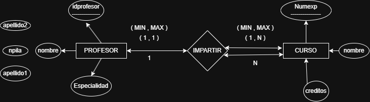
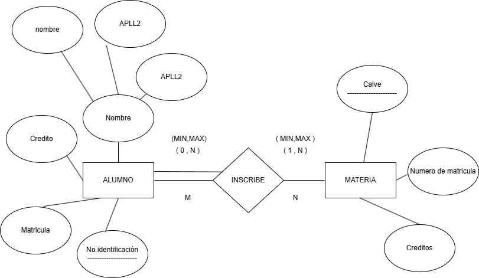
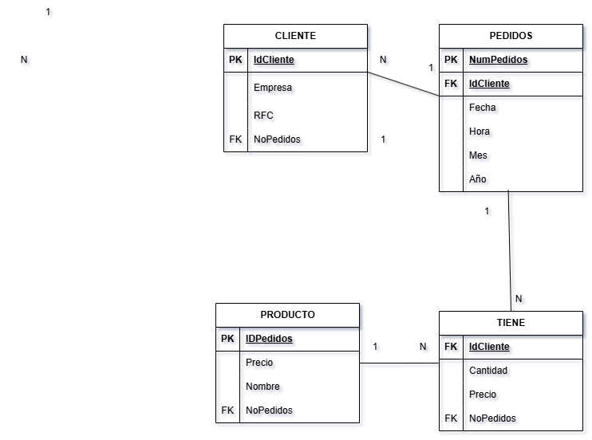
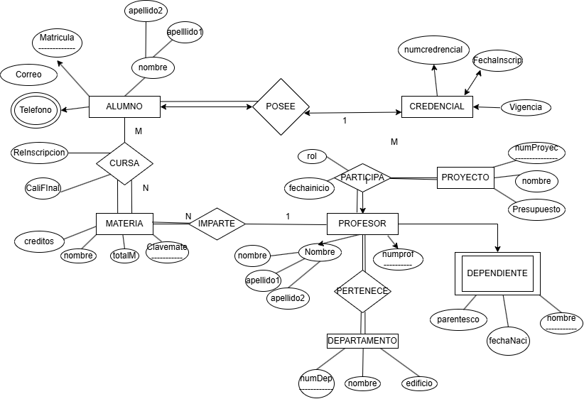
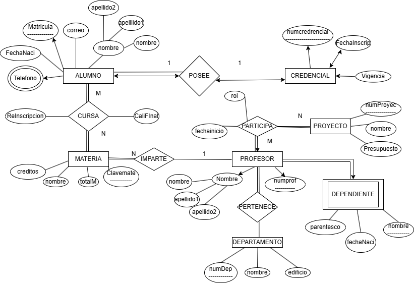
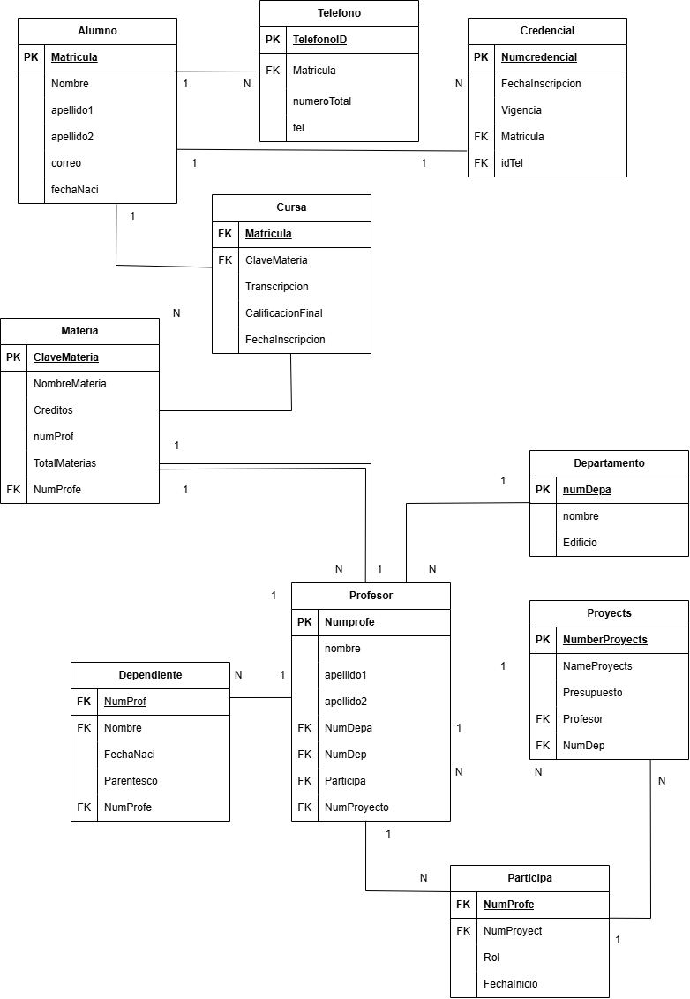

## EJERCICIO 1
## Modelo E-R

##  Modelo E-R 

## EJERCICIO 2
## Modelo E-R
---

##  Modelo E-R 

.png)
---
 ## EJERCICIO 3
## Modelo E-R
---

##  Modelo E-R 

---
 ## EJERCICIO 4
## Modelo E-R
---

##  Modelo E-R 

---
 ## EJERCICIO 5
## Modelo E-R
---

##  Modelo E-R 

---
 ## EJERCICIO 6
## Modelo E-R
---

##  Modelo E-R 

---
 ## EJERCICIO 7
## Modelo E-R
---

##  Modelo E-R 

---
